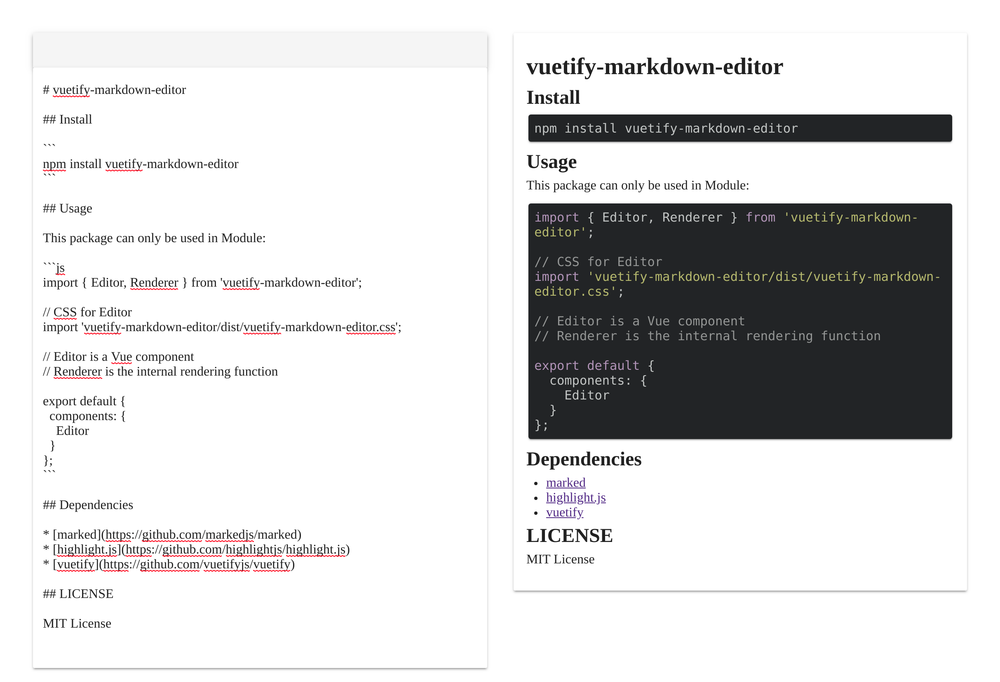
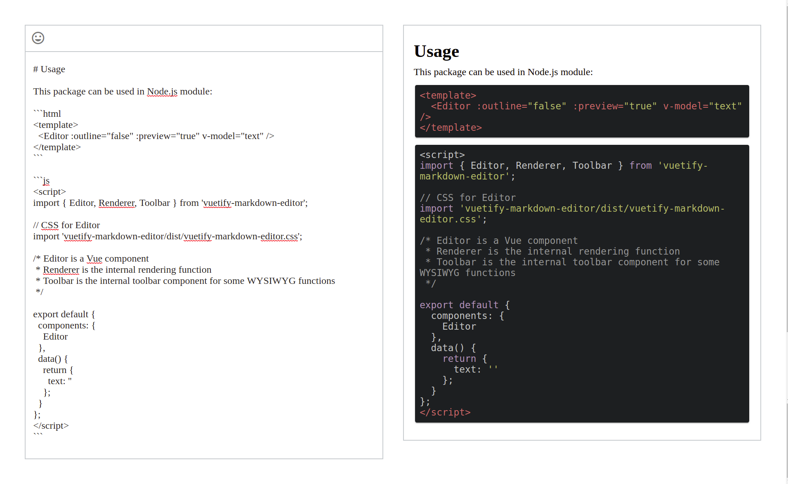
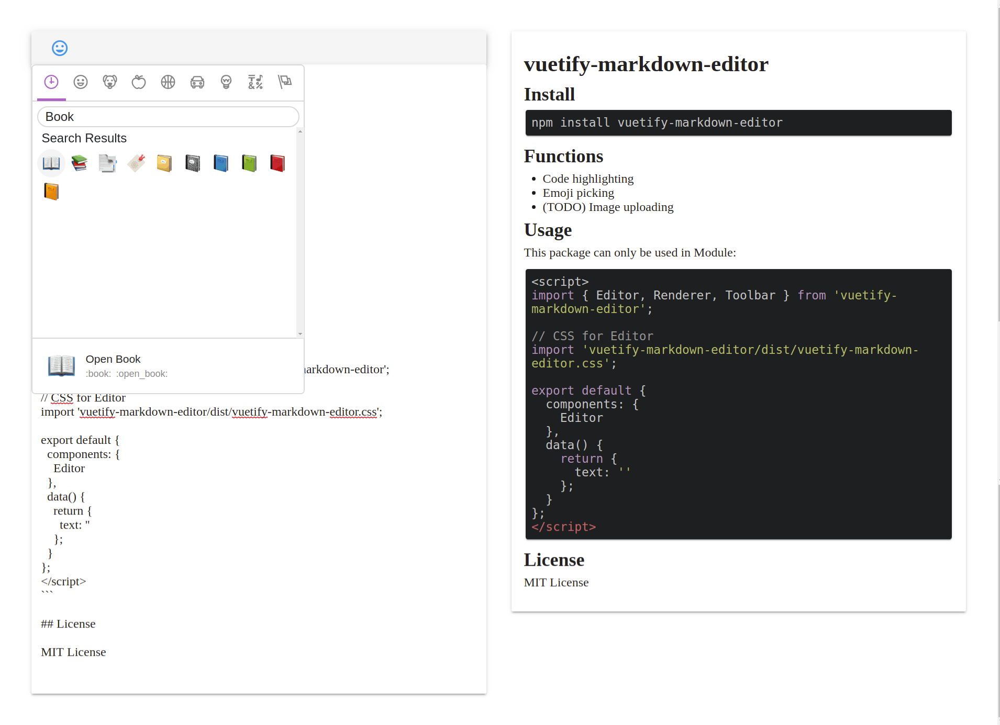

# vuetify-markdown-editor

## Install 

```
npm install vuetify-markdown-editor
```

## Features

* Solo and inline mode
* Editor-only and Editor-Preview mode
* Code highlighting
* Emoji picking
* (TODO) Image uploading

## Usage

Since this component is based on Vuetify,
the configuration of Vuetify is required:

```js
import Vuetify from 'vuetify';
import 'vuetify/dist/vuetify.min.css';

Vue.use(Vuetify);
```

This package can be used in Node.js module:

```html
<template>
  <v-app>
    <Editor ref="editor" :outline="true" :preview="true" v-model="text" />
  </v-app>
</template>
```

```js
<script>
import { Editor } from './build-entry.js';

export default {
  name: 'app',
  components: {
    Editor
  },
  data() {
    return {
      text: ''
    };
  },
  mounted() {
    this.$refs.editor.focus();
  }
};
</script>
```

## Props

| Prop        | Default      | Description                                                     |
|-------------|--------------|-----------------------------------------------------------------|
| value       | `''`         | String that binds to the textarea                               |
| mode        | `'Rendered'` | When set to 'Source', the preview will display html source code |
| outline     | `false`      | The border will be outlined instead of card style               |
| color       | `undefined`  | The outline and icon's color                                    |
| preview     | `true`       | Add the responsive preview                                      |
| nativeEmoji | `false`      | Use native emoji instead of pictures                            |


## Test

Clone this repository,
and then run:

```
npm install
npm run serve
```

Then open <http://localhost:8080> in browser to test.


## Screenshot

Solo mode: `<Editor v-model="text" />`


Outline mode: `<Editor outline v-model="text" />`


Emoji:



## Dependencies

* [marked](https://github.com/markedjs/marked)
* [highlight.js](https://github.com/highlightjs/highlight.js)
* [Vuetify](https://github.com/vuetifyjs/vuetify)
* [emoji-mart-vue](https://github.com/serebrov/emoji-mart-vue)
* [v-click-outside](https://github.com/ndelvalle/v-click-outside)

## License

MIT License

