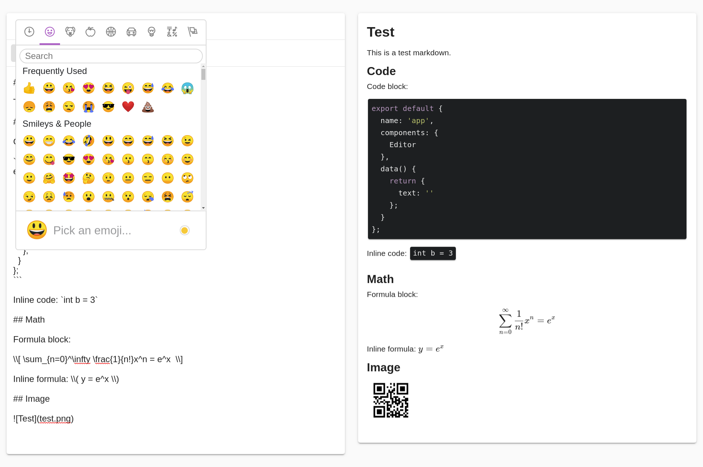

# vuetify-markdown-editor

[](https://www.npmjs.com/package/vuetify-markdown-editor)
[](https://www.npmjs.com/package/vuetify-markdown-editor)
[](https://github.com/DCsunset/vuetify-markdown-editor/blob/master/LICENSE)

A Vue.js Component for editing and previewing markdown using Vuetify.js and command line rendering utility.

## Install 

```
npm install vuetify-markdown-editor
```

Since this component is based on Vuetify,
it is required to install and configure Vuetify.
For installing Vuetify, please visit <https://vuetifyjs.com/en/getting-started/quick-start>.

## Command line utility

This package also provides a command line utility to render markdown files.

Install globally:

```
npm install -g vuetify-markdown-editor
```

Or install locally and use `npx` to run:

```
npm install vuetify-markdown-editor
npx render-cli input.md [output.html]
```

Usage:

```
render-cli input.md [output.html]
```

To use the rendered html,
remember to add css files for Katex and highlight.js:

```html
<link rel="stylesheet" href="https://cdn.jsdelivr.net/npm/katex@0.10.2/dist/katex.min.css" integrity="sha384-yFRtMMDnQtDRO8rLpMIKrtPCD5jdktao2TV19YiZYWMDkUR5GQZR/NOVTdquEx1j" crossorigin="anonymous">
<link rel="stylesheet" href="https://cdnjs.cloudflare.com/ajax/libs/highlight.js/9.15.8/styles/default.min.css">
```

## Features

* Solo and inline mode
* Editor-only and Editor-Preview mode
* Code highlighting
* Emoji picking
* Math formula (use `\\[` and `\\]` for formula block, and `\\(` and `\\)` for inline formula)
* (TODO) Image uploading
* (TODO) Provide an option to disable spell checking

## Usage

This package can be used in Node.js module:

```html
<template>
  <v-app>
    <Editor ref="editor" :outline="true" :preview="true" v-model="text" />
  </v-app>
</template>
```

```js
<script>
import { Editor } from 'vuetify-markdown-editor';

export default {
  name: 'app',
  components: {
    Editor
  },
  data() {
    return {
      text: ''
    };
  },
  mounted() {
    this.$refs.editor.focus();
    // Dark theme
    //this.$vuetify.theme.dark = true;
  }
};
</script>
```

## Props

| Prop        | Default      | Description                                                     |
|-------------|--------------|-----------------------------------------------------------------|
| value       | `''`         | String that binds to the textarea                               |
| mode        | `'Rendered'` | When set to 'Source', the preview will display html source code |
| outline     | `false`      | The border will be outlined instead of card style               |
| color       | `undefined`  | The outline and icon's color                                    |
| preview     | `true`       | Add the responsive preview                                      |
| nativeEmoji | `false`      | Use native emoji instead of pictures                            |
| hint        | `''`         | Add description at the bottom                                   |


## Test

Clone this repository,
and then run:

```
npm install
npm run serve
```

Then open <http://localhost:8080> in browser to test.


## Screenshots

Solo mode: `<Editor v-model="text" />`


Outline mode: `<Editor outline v-model="text" />`


Emoji:



## Dependencies

* [KaTex](https://github.com/KaTeX/KaTeX)
* [marked](https://github.com/markedjs/marked)
* [highlight.js](https://github.com/highlightjs/highlight.js)
* [Vuetify](https://github.com/vuetifyjs/vuetify)
* [emoji-mart-vue](https://github.com/serebrov/emoji-mart-vue)
* [v-click-outside](https://github.com/ndelvalle/v-click-outside)

## License

MIT License
