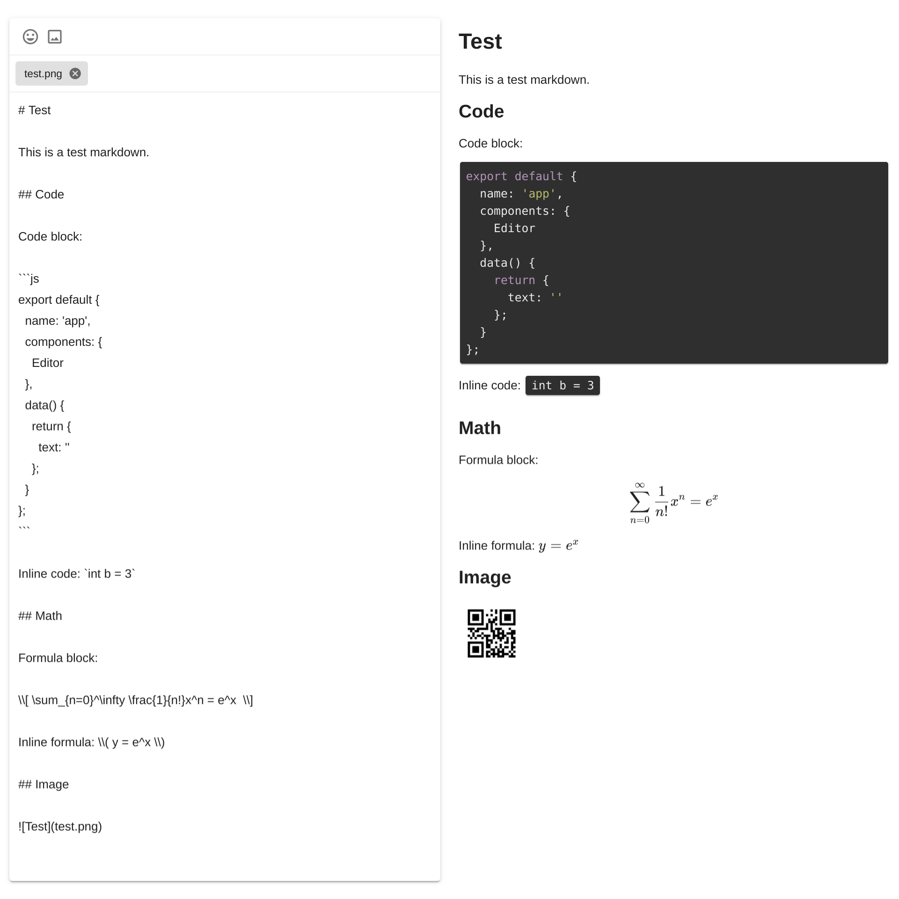

# vuetify-markdown-editor

[](https://www.npmjs.com/package/vuetify-markdown-editor)
[](https://www.npmjs.com/package/vuetify-markdown-editor)
[](https://github.com/DCsunset/vuetify-markdown-editor/blob/master/LICENSE)

A Vue.js Component for editing and previewing markdown using Vuetify.js and markdown-it.

## Install

```
npm install vuetify-markdown-editor
```

Since this component is based on Vuetify,
it is required to install and configure Vuetify.
For installing Vuetify, please visit <https://vuetifyjs.com/en/getting-started/quick-start>.


## Features

- Solo and inline mode
- Editor-only and Editor-Preview mode
- Code highlighting
- Emoji picking
- Math formula (See [markdown-it-texmath](https://github.com/goessner/markdown-it-texmath))
- Image uploading and previewing (to use uploaded image in markdown, use the filename as the link)
- Mermaid diagram rendering (use code block with language `mermaid`)

## TODO

* [x] Fix SSR
* [x] Allow to change sets of emoji
* [x] Add typescript support
* [x] Add copy icon
* [x] Add viewer mode
* [ ] Fix large image
* [ ] Add self-hosted emoji images
* [ ] Add emoji rendering in rendered text
* [ ] Add more WYSIWYG functions
* [ ] Add plantuml support

## Usage

This package can be used in Node.js module:

```html
<template>
  <v-app>
    <Editor
      mode="Rendered"
      ref="editor"
      hint="Test"
      nativeEmoji
      :outline="false"
      :preview="true"
      v-model="text"
      />
  </v-app>
</template>

<script>
import { Editor } from 'vuetify-markdown-editor';
import 'vuetify-markdown-editor/dist/vuetify-markdown-editor.css';

export default {
  name: 'app',
  components: {
    Editor
  },
  data() {
    return {
      text: ''
    };
  },
  mounted() {
    // Access properties or methods using $refs
    this.$refs.editor.focus();
    // this.$refs.editor.upload();

    // Dark theme
    //this.$vuetify.theme.dark = true;
  }
};
</script>
```

To show the rendered html only, use `viewer` mode.

To use the markdown-it renderer directly,
use `createRenderer` to create it.

## Exported modules

* Editor: a vue component to edit markdown
* createRenderer: a function to create a markdown-it render

## Props

|   Prop          | Default                                 | Description                                                      |
| ------------- | --------------------------------------- | ---------------------------------------------------------------- |
| value         | `''`                                    | String that binds to the textarea                                |
| mode          | `'preview'`                            | Possible value `'editor'`, `'preview'` or `'viewer'`. When set to `'editor'` or `'viewer'`, only the editor or viewer is displayed, while `'preview'` mode displays both. |
| renderConfig  | `undefined`                             | Override default configurations                                  |
| outline       | `false`                                 | The border will be outlined instead of card style                |
| color         | `undefined`                             | The outline and icon's color                                     |
| nativeEmoji   | `false`                                 | Use native emoji instead of pictures                             |
| emoji         | `true`                                  | Enable emoji input                                               |
| emojiSet      | `"apple"`                               | Supported emoji sets: `'apple', 'google', 'twitter', 'facebook'` |
| image         | `true`                                  | Enable image upload                                              |
| hint          | `''`                                    | Add description at the bottom                                    |
| fileTarget    | `'/'`                                     | Image upload target uri                                          |
| fileFilter    | `file => file.type.startsWith('image')` | Allow only specific files. Return true to allow, false to reject |
| baseUrl | `'/'` | The baseUrl for uploaded images. **Must end with a slash** (mainly used in `viewer` mode) |

## Default Renderer Configurations

```js
{
  // markdown-it-texmath config
  texmath: undefined,
  // markdown-it-highlightjs config
  hightlightjs: undefined,
  // markdown-it-code-copy config
  codeCopy: {
    buttonClass: 'v-icon theme--dark'
  },
  // The native mermaid config
  mermaid: undefined
}
```

## Methods

| Method   | Description                                 |
| -------- | ------------------------------------------- |
| upload() | Start or resume uploading all files in list |
| pause()  | Pause uploading                             |
| resume() | Resume uploading                            |
| focus()  | Focus on the editor                         |

## Properties

| Property | Description                                                                            |
| -------- | -------------------------------------------------------------------------------------- |
| files    | Get all files in list in [FlowFile](https://github.com/flowjs/flow.js#flowfile) format |

## Test

Clone this repository,
and then run:

```
npm install
npm run serve
```

Then open <http://localhost:8080> in browser to test.

## Screenshots

Solo mode: `<Editor v-model="text" />`



Dark mode: `this.$vuetify.theme.dark = true;`


Outline mode: `<Editor outline v-model="text" />`


## Dependencies

- [mermaid](https://github.com/mermaid-js/mermaid)
- [KaTeX](https://github.com/KaTeX/KaTeX)
- [markdown-it](https://github.com/markdown-it/markdown-it)
- [markdown-it-highlightjs](https://github.com/valeriangalliat/markdown-it-highlightjs)
- [markdown-it-texmath](https://github.com/goessner/markdown-it-texmath)
- [markdown-it-code-copy](https://github.com/DCsunset/markdown-it-code-copy)
- [markdown-it-mermaid-plugin](https://github.com/DCsunset/markdown-it-mermaid-plugin)
- [Vuetify](https://github.com/vuetifyjs/vuetify)
- [emoji-mart-vue](https://github.com/serebrov/emoji-mart-vue)
- [v-click-outside](https://github.com/ndelvalle/v-click-outside)
- [Flow.js](https://github.com/flowjs/flow.js)

## License

MIT License
