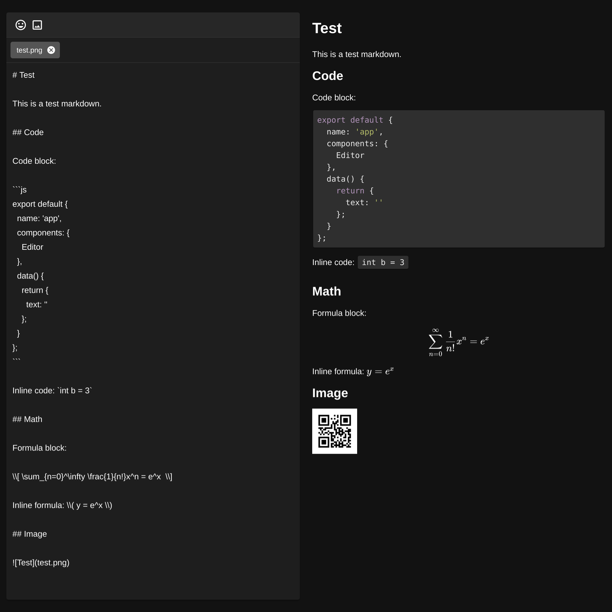

# vuetify-markdown-editor

[](https://www.npmjs.com/package/vuetify-markdown-editor)
[](https://www.npmjs.com/package/vuetify-markdown-editor)
[](https://github.com/DCsunset/vuetify-markdown-editor/blob/master/LICENSE)

A Vue.js Component for editing and previewing markdown using Vuetify.js and command line rendering utility.

## Install

```
npm install vuetify-markdown-editor
```

Since this component is based on Vuetify,
it is required to install and configure Vuetify.
For installing Vuetify, please visit <https://vuetifyjs.com/en/getting-started/quick-start>.

## Command line utility

This package also provides a command line utility to render markdown files.

Install globally:

```
npm install -g vuetify-markdown-editor
```

Or install locally and use `npx` to run:

```
npm install vuetify-markdown-editor
npx render-cli input.md [output.html]
```

Usage:

```
render-cli input.md [output.html]
```

If the output filename is not specified,
it will print in the stdout.

To use the rendered html,
remember to add css files for Katex and highlight.js:

```html
<link
	rel="stylesheet"
	href="https://cdn.jsdelivr.net/npm/katex@0.10.2/dist/katex.min.css"
	integrity="sha384-yFRtMMDnQtDRO8rLpMIKrtPCD5jdktao2TV19YiZYWMDkUR5GQZR/NOVTdquEx1j"
	crossorigin="anonymous"
/>
<link
	rel="stylesheet"
	href="https://cdnjs.cloudflare.com/ajax/libs/highlight.js/9.15.8/styles/default.min.css"
/>
```

## Features

- Solo and inline mode
- Editor-only and Editor-Preview mode
- Code highlighting
- Emoji picking
- Math formula (use `\\[ formula \\]` or `$$ formula $$` for formula block, and `\\( formula \\)` or `$ formula $`for inline formula)
- Image uploading and previewing (to use uploaded image in markdown, use the filename as the link)
- Mermaid diagram rendering (use code block with language `mermaid`)

## TODO

* [ ] Fix SSR
* [ ] Allow to change sets of emoji
* [ ] Add more WYSIWYG functions
* [ ] Add plantuml support

## Usage

This package can be used in Node.js module:

```html
<template>
  <v-app>
    <Editor
      mode="Rendered"
      ref="editor"
      hint="Test"
      nativeEmoji
      :outline="false"
      :preview="true"
      v-model="text"
      />
  </v-app>
</template>

<script>
import { Editor } from 'vuetify-markdown-editor';

export default {
  name: 'app',
  components: {
    Editor
  },
  data() {
    return {
      text: ''
    };
  },
  mounted() {
    // Access properties or methods using $refs
    this.$refs.editor.focus();
    // this.$refs.editor.upload();

    // Dark theme
    //this.$vuetify.theme.dark = true;
  }
};
</script>
```

## Props

| Prop          | Default                                 | Description                                                      |
| ------------- | --------------------------------------- | ---------------------------------------------------------------- |
| value         | `''`                                    | String that binds to the textarea                                |
| mode          | `'Rendered'`                            | When set to 'Source', the preview will display html source code  |
| renderOptions | `undefined`                             | Override default options                                         |
| renderConfig  | `undefined`                             | Override default configurations                                  |
| outline       | `false`                                 | The border will be outlined instead of card style                |
| color         | `undefined`                             | The outline and icon's color                                     |
| preview       | `true`                                  | Add the responsive preview                                       |
| nativeEmoji   | `false`                                 | Use native emoji instead of pictures                             |
| emoji         | `true`                                  | Enable emoji input                                               |
| image         | `true`                                  | Enable image upload                                              |
| hint          | `''`                                    | Add description at the bottom                                    |
| fileTarget    | `/`                                     | Image upload target uri                                          |
| fileFilter    | `file => file.type.startsWith('image')` | Allow only specific files. Return true to allow, false to reject |

### Default render options

```js
{
  katex: true, // katex support
  mermaid: true // mermaid support
}
```

The renderer uses cache to accelerate rendering
so that modification of other parts won't cause the mermaid diagram
to be rendered again,
But there's some delay when rendering new mermaid diagrams,
due to the delay of mermaid renderer itself.

### Renderer Configurations

```js
{
	katex: {
    // formula delimiters
		delimiters: [
			{
				left: '$$',
				right: '$$',
				options: {
					displayMode: true // block
				}
			},
			{
				left: '\\[',
				right: '\\]',
				options: {
					displayMode: true // block
				}
			},
			{
				left: '$',
				right: '$',
				options: {
					displayMode: false // inline
				}
			},
			{
				left: '\\(',
				right: '\\)',
				options: {
					displayMode: false // inline
				}
			}
		]
  },
  mermaid: undefined // The native mermaid config
}
```

## Methods

| Method   | Description                                 |
| -------- | ------------------------------------------- |
| upload() | Start or resume uploading all files in list |
| pause()  | Pause uploading                             |
| resume() | Resume uploading                            |
| focus()  | Focus on the editor                         |

## Properties

| Property | Description                                                                            |
| -------- | -------------------------------------------------------------------------------------- |
| files    | Get all files in list in [FlowFile](https://github.com/flowjs/flow.js#flowfile) format |

## Test

Clone this repository,
and then run:

```
npm install
npm run serve
```

Then open <http://localhost:8080> in browser to test.

## Screenshots

Solo mode: `<Editor v-model="text" />`


Outline mode: `<Editor outline v-model="text" />`


Dark mode: `this.$vuetify.theme.dark = true;`


Emoji:


## Dependencies

- [mermaid](https://github.com/mermaid-js/mermaid)
- [KaTex](https://github.com/KaTeX/KaTeX)
- [marked](https://github.com/markedjs/marked)
- [highlight.js](https://github.com/highlightjs/highlight.js)
- [Vuetify](https://github.com/vuetifyjs/vuetify)
- [emoji-mart-vue](https://github.com/serebrov/emoji-mart-vue)
- [v-click-outside](https://github.com/ndelvalle/v-click-outside)
- [Flow.js](https://github.com/flowjs/flow.js)

## License

MIT License
